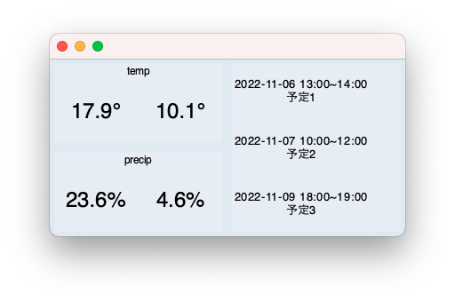

# Show-Weather-and-Schedules

## Overview
  

気温, 降水確率, 予定をAPIを利用して取得し, Tkinterで表示するコードを作成しました.
気温と降水確率は気象庁から取得し，予定はGoogle Calendarから取得しています．

## Requirement
- MacOS
- VisualStudio
- Python 3.9.0

## Usage
[Google Calendar for Develop](https://developers.google.com/calendar/api/quickstart/python#set_up_your_environment)にあるPython quickstartの環境のセットアップを行い，main.pyをターミナルで実行する.

`$ ./main.py`

## Reference
[Google Calendar for Develop](https://developers.google.com/calendar/api/quickstart/python)  
[天気予報(pythonとapi)](https://note.com/dfgh/n/n77b48740738f)

## Author
Twitter    : [@kazun6ri](https://twitter.com/kazun6ri)